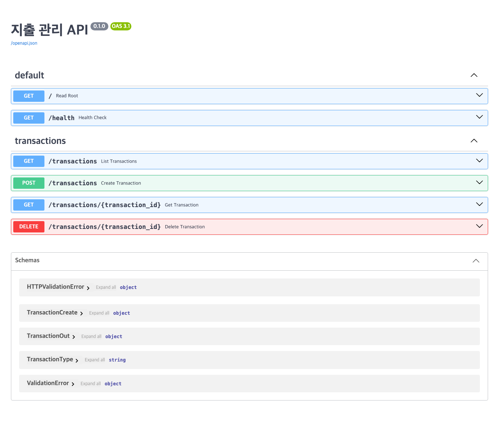

# 지출 관리 API (expense-api)

**배포 URL:** <https://expense-api-32zr.onrender.com> · **Swagger UI:** <https://expense-api-32zr.onrender.com/docs>

> Render 무료 플랜이라 15분간 요청이 없으면 잠듭니다. 첫 접속은 깨어나는 데 30~60초 걸릴 수 있고,
> 임시 저장소(메모리)라 그때 등록해 둔 거래도 함께 사라집니다 — 둘 다 정상이며 영속화는 4주차입니다.

클라우드컴퓨팅실습 3주차 실습 기록입니다.
가계부(지출 관리) CRUD API를 FastAPI로 처음부터 만들어 Render에 배포했습니다.
데이터는 임시 저장소(파이썬 리스트)에 두며, 진짜 DB 연결은 4주차에 합니다.

## 엔드포인트

| 메서드 | 경로 | 하는 일 | 성공 코드 |
| --- | --- | --- | --- |
| GET | `/` | 환영 메시지 | 200 |
| GET | `/health` | 서버가 살아 있는지 확인 | 200 |
| GET | `/transactions` | 거래 목록 (`skip`·`limit`으로 페이지네이션) | 200 |
| POST | `/transactions` | 거래 등록 | 201 |
| GET | `/transactions/{id}` | 거래 단건 조회 (없으면 404) | 200 |
| DELETE | `/transactions/{id}` | 거래 삭제 (없으면 404) | 204 |

API 명세는 따로 쓰지 않았습니다 — FastAPI가 `/openapi.json`으로 자동 생성합니다.

**요청 본문(`TransactionCreate`) 규칙**

| 필드 | 타입 | 규칙 |
| --- | --- | --- |
| `amount` | float | 0보다 커야 함 |
| `type` | enum | `income` 또는 `expense` |
| `category` | str | 1~50자 |
| `description` | str \| None | 200자 이하, 생략 가능 |
| `occurred_on` | date | `2026-09-15` 형식 |

## 프로젝트 구조

```text
expense-api/
├── app/
│   ├── __init__.py            # 패키지 표시
│   ├── main.py                # 앱 생성 + 라우터 조립
│   ├── models.py              # Pydantic 스키마
│   └── routers/
│       ├── __init__.py
│       └── transactions.py    # 거래 경로 + 임시 저장소
├── requirements.txt           # Render가 설치할 패키지
├── render.yaml                # Render 배포 설정
└── .gitignore
```

## 로컬에서 실행하기

```bash
python3 -m venv .venv
source .venv/bin/activate        # Windows: .venv\Scripts\activate
pip install -r requirements.txt
fastapi dev app/main.py          # http://127.0.0.1:8000/docs
```

프로젝트 루트(`expense-api`)에서 실행해야 합니다. 다른 폴더에서 치면 `Path does not exist app/main.py`가 납니다.

---

## 실습 기록

### ① 결과 확인

등록 → 조회 → 삭제를 돌리고, 지운 id를 다시 조회하면 404가 나는 것을 확인했습니다.
아래는 **Render에 배포한 인터넷 주소**(`https://expense-api-32zr.onrender.com`)로 돌린 결과입니다.

Swagger UI — <https://expense-api-32zr.onrender.com/docs>



```console
$ R=https://expense-api-32zr.onrender.com

$ curl -s $R/
{"message":"지출 관리 API에 오신 것을 환영합니다"}

$ curl -s $R/health
{"status":"ok"}

# 등록 — 201, 서버가 id 와 created_at 을 채워 준다
$ curl -i -X POST $R/transactions \
    -H 'Content-Type: application/json' \
    -d '{"amount":12000,"type":"expense","category":"식비","description":"점심","occurred_on":"2026-09-15"}'
HTTP/1.1 201 Created
{"id":1,"amount":12000.0,"type":"expense","category":"식비","description":"점심",
 "occurred_on":"2026-09-15","created_at":"2026-09-20T14:56:20.681370"}

# 목록 — 200
$ curl -s $R/transactions
[{"id":1,"category":"식비","amount":12000.0,...},{"id":2,"category":"교통","amount":3200.0,...}]

# 단건 조회 — 200
$ curl -i $R/transactions/1
HTTP/1.1 200 OK

# 없는 id 조회 — 404
$ curl -i $R/transactions/999
HTTP/1.1 404 Not Found
{"detail":"999번 거래를 찾을 수 없습니다"}

# id 가 정수가 아님 — 422
$ curl -i $R/transactions/abc
HTTP/1.1 422 Unprocessable Content

# 삭제 — 204 (본문 없음)
$ curl -i -X DELETE $R/transactions/2
HTTP/1.1 204 No Content

# 지운 id 를 다시 삭제 — 404
$ curl -i -X DELETE $R/transactions/2
HTTP/1.1 404 Not Found
```

**일부러 틀린 값을 보냈을 때 (422)** — 세 가지 위반을 한 번에 잡아냅니다.

```console
$ curl -i -X POST $R/transactions \
    -H 'Content-Type: application/json' \
    -d '{"amount":-1,"type":"unknown","category":"","occurred_on":"2026-09-15"}'
HTTP/1.1 422 Unprocessable Content
  amount   : Input should be greater than 0
  type     : Input should be 'income' or 'expense'
  category : String should have at least 1 character
```

경로 매개변수도 같습니다 — `GET /transactions/abc`는 `int`로 바꿀 수 없어 **422**입니다.
검증 코드를 한 줄도 쓰지 않았는데 막혔고, `create_transaction` 함수 본문은 실행조차 되지 않았습니다.

### ② 핵심 개념 되새김

- **CRUD 네 동작과 HTTP 메서드** — 만들기는 POST, 읽기는 GET, 고치기는 PUT/PATCH, 지우기는 DELETE다.
  "무엇을" 할지는 경로(`/transactions/3`)가, "어떻게" 할지는 메서드가 나눠 맡아서 같은 주소로도 다른 일을 시킬 수 있다.
- **Pydantic 검증이 막아 주는 것** — 잘못된 데이터가 내 함수에 **도착하기 전에** 걸러진다.
  `amount`에 음수, `type`에 오타, `category`에 빈 문자열을 넣으면 함수가 실행되기도 전에 422와 함께
  어디가 왜 틀렸는지 전부 돌려준다. 덕분에 함수 안에 "값이 있나 없나" 검사를 쓸 일이 없다.
- **`/docs`가 어디서 나오는가** — 내가 쓴 경로 선언(`@router.post("")`)과 타입 힌트, Pydantic 모델을
  FastAPI가 읽어 `/openapi.json`을 만들고, Swagger UI가 그 JSON을 그려 준 것이다.
  문서를 만드는 코드는 한 줄도 쓰지 않았고, 코드를 고치면 문서도 같이 바뀐다.

### ③ 자유 로그

2주차에 메모 앱 만들 때는 CRUD를 그냥 따라만 쳤는데, 이번 주에 제대로 하니까 그때 내가 뭘 한 건지
이제야 알겠다.

제일 와닿았던 건 요청 모델이랑 응답 모델을 왜 나누는지였다. 등록할 때는 `id`가 없는 게 맞고
(서버가 만드는 거니까) 돌려줄 때는 있어야 하는데, 하나로 합쳤으면 이건 넣어야 하나 말아야 하나로
계속 헷갈렸을 것 같다.

일부러 틀린 값 보내보는 게 제일 재밌었다. `amount`에 -1, `type`에 `"unknown"`, `category`에 빈
문자열을 한 번에 넣었는데 세 개 다 따로따로 이유를 붙여서 돌려줬다. 내가 쓴 검증 코드는
`Field(gt=0)` 같은 선언 몇 줄이 전부인데.

단계 5에서 파일 나누는 건 처음엔 왜 하나 싶었다. 잘 돌아가는 `main.py`를 굳이 쪼개는 게 번거로워
보였는데, 막상 나누고 나니까 데이터 모양은 `models.py`, 경로는 `routers/` 이렇게 찾을 자리가
정해져서 오히려 편했다. 대신 옮길 때 `@app.`을 `@router.`로 바꾸는 걸 놓치기 쉬울 것 같아서
옮기고 나서 파일을 한 번 훑었다.

배포는 2주차랑 거의 똑같은데 Start Command 한 줄이 달랐다. 2주차는 `uvicorn main:app`이었는데
이번엔 `app/` 폴더로 옮겼으니까 `uvicorn app.main:app`. 워크북에서 미리 짚어줘서 502는 안 봤다.
코드는 한 줄도 안 고치고 그대로 인터넷에 올라간 게 좀 신기했다.

아직 모르겠는 것 — 서버 끄면 데이터가 사라진다. SQLite로 바꾸는 게 심화에 있는데 4주차가
정식이라고 해서 이번엔 넘겼다. Render 무료 플랜이 15분마다 자는 것도 지금은 정상이라고 하니까
넘어가는데, 진짜 서비스면 이걸 어떻게 하는 건지는 모르겠다.

AI 사용 — Claude Code한테 워크북 단계 1~6을 그대로 따라서 만들라고 시켰다. 대신 말은 안 믿고
직접 다 돌려봤다. 로컬 띄워서 `/`, `/health`, `/docs` 뜨는지 보고, 등록이 201로 `id` 돌려주는지,
없는 id가 404인지, `abc`가 422인지, 삭제가 204이고 같은 걸 또 지우면 404인지 하나씩 호출해서
상태 코드랑 본문을 눈으로 확인했다(위 ① 기록이 그거다). 배포하고 나서는 같은 걸 인터넷 주소로
한 번 더 돌려서 로컬이랑 같은지 봤다.
